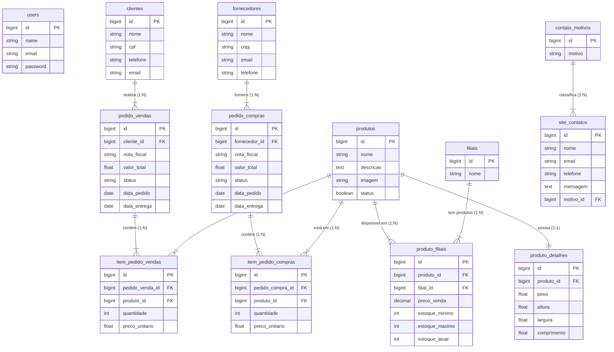

# Documentação do Projeto Super Gestão

## Visão Geral
O projeto **Super Gestão** é uma aplicação web desenvolvida em Laravel voltada para o gerenciamento de processos empresariais (ERP simplificado) e um site institucional dinâmico. O sistema abrange controle de clientes, fornecedores, produtos, filiais e pedidos, além de gerenciar o conteúdo do site institucional.

## Estrutura do Projeto

### Diretórios Principais
- `app/Models`: Camada de dados (Eloquent ORM).
- `app/Http/Controllers`: Lógica de negócios e controle de fluxo.
- `database/migrations`: Versionamento do esquema de banco de dados.
- `resources/views`: Interface do usuário (Blade Templates).
- `routes`: Definição de rotas web.

---

## Banco de Dados (Schema)

O banco de dados suporta tanto a operação do sistema de gestão quanto o conteúdo dinâmico do site.

### Módulos de Gestão (ERP)
- **users**: Usuários do sistema com acesso à área administrativa.
- **clientes**: Base de clientes (PF/PJ).
- **fornecedors**: Base de fornecedores.
- **produtos**: Catálogo de produtos.
- **filials**: Unidades físicas da empresa.
- **produto_detalhes**: Informações técnicas (dimensões, peso) - Relacionamento 1:1 com produtos.
- **produto_filiais**: Controle de estoque e preço por filial - Relacionamento N:N.
- **pedido_vendas** / **item_pedido_vendas**: Gestão de vendas.
- **pedido_compras** / **item_pedido_compras**: Gestão de compras/suprimentos.

### Módulos do Site (CMS & Institucional)
- **site_clientes**: Informações gerais da empresa exibidas no site (telefone, endereço, redes sociais).
- **site_componentes**: Elementos dinâmicos das páginas do site (banners, seções de texto).
- **site_contatos**: Registros de mensagens enviadas pelo formulário de contato.
- **contato_motivos**: Categorização dos motivos de contato (Dúvida, Elogio, Reclamação).

### Auditoria e Logs
- **log_acessos**: Registro de acessos e atividades no sistema.

---

## Models e Lógica de Negócio

A aplicação utiliza Eloquent ORM para abstração de dados.

### Principais Entidades
- **Produto** (`Produto.php`): Centraliza a lógica de catálogo. Possui relacionamentos com `ProdutoDetalhe` e `ProdutoFilial`.
- **PedidoVenda** / **PedidoCompra**: Controlam o fluxo de entrada e saída de mercadorias.
- **Cliente** / **Fornecedor**: Entidades participantes das transações.

### Gestão de Conteúdo (CMS)
- **SiteCliente**: Gerencia os dados institucionais da empresa.
- **SiteComponente**: Permite a renderização dinâmica de componentes nas views do site (ex: `index`, `sobre-nos`).
- **ContatoMotivo**: Alimenta os selects de formulários de contato.

---

## Camada HTTP e Rotas

### Área Pública (Site)
Gerenciada principalmente pelo `SiteController`.
- **/**: Página inicial (carrega componentes dinâmicos via `SiteComponenteController`).
- **/sobre-nos**: Página institucional.
- **/contato**: Formulário de contato (integra com `ContatoController` e `ContatoMotivo`).

### Área Restrita (Sistema)
Requer autenticação (`auth`) e verificação de email (`verified`).
- **/home**: Dashboard administrativo.
- **/produto**: CRUD completo de produtos.
- **/cliente**: Gestão de clientes.
- **/fornecedor**: Gestão de fornecedores.
- **/filial**: Gestão de filiais.
- **/pedido/venda** e **/pedido/compra**: Fluxos transacionais.

### Controllers Auxiliares
- **SiteClienteController** e **SiteComponenteController**: Não possuem rotas diretas, mas são injetados no `SiteController` para fornecer dados estruturados às views, funcionando como serviços de conteúdo.

---

## Interface (Views)

Utiliza **Blade Templates** com estrutura de layouts.
- `resources/views/site`: Páginas públicas (`index`, `sobre-nos`, `contato`).
- `resources/views/app`: Área administrativa, dividida por módulos (`produto`, `cliente`, etc.).
- `resources/views/auth`: Telas de autenticação. [Recurso do Laravel]

## Diagrama ER (Entidade-Relacionamento)

